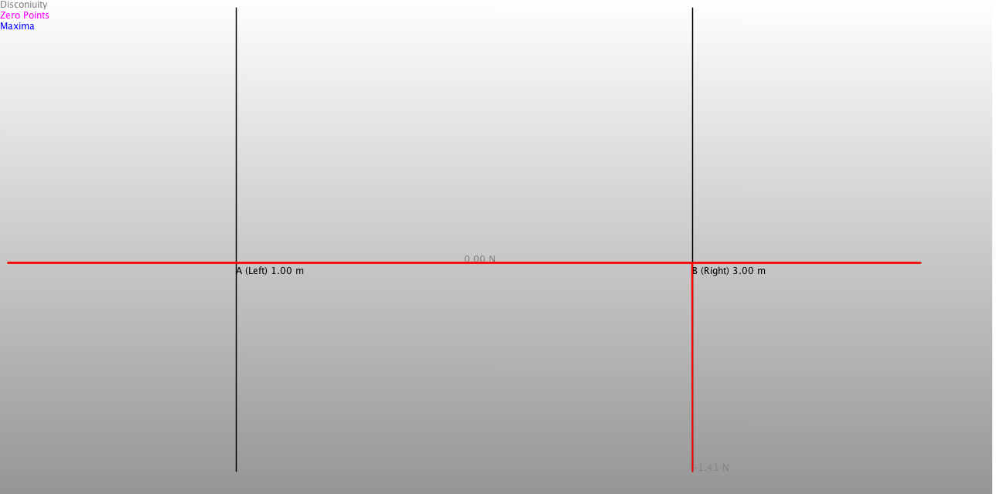

Beam Calc
=========
Calculates the supporting forces of a simply supported beam.

Beam and acting loads
---------------------

Sample output
-------------
	Beam:
	Length=4.0
	Supports sorted by distance from left end of beam:
	Support A (Left)    xn=0.0
	Support B (Right)    xn=4.0

	Number of Loads:2
	Loads sorted by distance from left end of beam:
	Name:q1 Magnitute at start:-5.0 Point Load:-5.0 distance from left end:0.0 Lengtht:4.0  Force at end:-5.0 Resulting force:-20.0 is acting 2.0 m from left end of beam.
	Name:F1 Magnitute at start:-2.0 Point Load:-2.0 distance from left end:2.0 Lengtht:0.0  Force at end:-2.0 Resulting force:-2.0 is acting 2.0 m from left end of beam.

	RESULT:
	Left support:10.707106781186548 N. Right bearing:10.707106781186548 N.
	Horizontal force at right support:1.414213562373095
	Term:N=2.0 N x sin(45.0) = 1.41N
	Term:B (Right)=5.0N x 4.0m + 2.0N x cos(45.0) + (-10.71N) = 10.71N
	Term:A (Left)=(5.0 N/m x 4.0m x 2.0m+2.0N x cos(45.0) x 2.0m)/4.0m = 10.71N

	=== Shearing forces => Q ===
	Local maxi-/  minima
	Points of disconuity in Q
	x=0.0 m   Q=10.706106781186547 N
	x=2.0 m   Q=-0.7081067811881641 N
	x=4.0 m   Q=-5.000000032335805E-4 N

	=== Bending moment => M ===
	Local maxi-/  minima
	x=1.9998999999997962 m   M=11.410643101686322 Nm
	Points of disconuity in M
	x=0.0 m   M=0.0 Nm
	x=1.9999999999997962 m   M=11.410289362442864 Nm

	=== Normal forces => N ===
	x=2.0 m   N[N]=-1.414213562373095 N

Stress resultants:

Shearing forces.

Bending moments.

Normal forces.

Screenshot of "Beam Calc". An Android app using this library. The screenshot shows the problem. The solution is shown in the following shell- output:

You can get the Android app here:
[Google Play, Beam Calc](https://play.google.com/store/apps/details?id=berthold.beamcalc)

