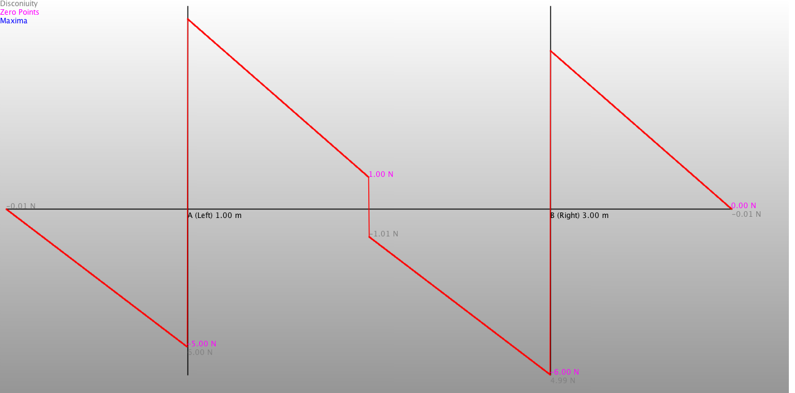

Calculates the supporting forces of a simply supported beam.

Beam and acting loads
---------------------

Sample output
-------------
	Beam:
Length=4.0
Supports sorted by distance from left end of beam:
Support A (Left)    xn=1.0
Support B (Right)    xn=3.0

Number of Loads:2
Loads sorted by distance from left end of beam:
Name:q1 Magnitute at start:-5.0 Point Load:-5.0 distance from left end:0.0 Lengtht:4.0  Force at end:-5.0 Resulting force:-20.0 is acting 2.0 m from left end of beam.
Name:F1 Magnitute at start:-2.0 Point Load:-2.0 distance from left end:2.0 Lengtht:0.0  Force at end:-2.0 Resulting force:-2.0 is acting 2.0 m from left end of beam.

RESULT:
Left support:11.0 N. Right bearing:11.0 N.
Horizontal force at right support:0.0
Term:N=0.00N
Term:B (Right)=5.0N x 4.0m + 2.0N + (-11.00N) = 11.00N
Term:A (Left)=(5.0 N/m x 4.0m x 1.0m+2.0N x 1.0m)/2.0m = 11.00N

=== Shearing forces => Q ===
Local maxi-/  minima
Points of disconuity in Q
x=0.0 m   Q=-0.01 N
x=1.0 m   Q=5.995000000000084 N
x=2.0 m   Q=-1.0099999999998097 N
x=3.0 m   Q=4.990000000000296 N
x=3.9999999999996705 m   Q=-0.009999999999619792 N
Zero points in Q
x=0.9980000000000008 m
x=1.9989999999998906 m
x=2.9989999999997807 m
x=3.9979999999996707 m

=== Bending moment => M ===
Local maxi-/  minima
x=0.0 m   M=0.0 Nm
x=0.9980000000000008 m   M=-2.5049725149999653 Nm
x=1.9989999999998906 m   M=0.9970029950001726 Nm
x=2.9989999999997807 m   M=-2.5269875049995836 Nm
x=3.9979999999996707 m   M=-0.018966014999237325 Nm
Points of disconuity in M
x=0.9990000000000008 m   M=-2.488004504999965 Nm
x=1.9999999999998905 m   M=0.991985000000173 Nm
x=2.9999999999997806 m   M=-2.4890234999995826 Nm
Zero points in M
x=0.0 m
x=1.5339999999999419 m
x=2.4569999999998404 m
x=3.9999999999996705 m

=== Normal forces => N ===
x=2.0 m   N[N]=0.0 NBeam Calc

Stress resultants:

Shearing forces.

Bending moments.

Normal forces.

Screenshot of "Beam Calc". An Android app using this library. The screenshot shows the problem. The solution is shown in the following shell- output:

You can get the Android app here:
[Google Play, Beam Calc](https://play.google.com/store/apps/details?id=berthold.beamcalc)

