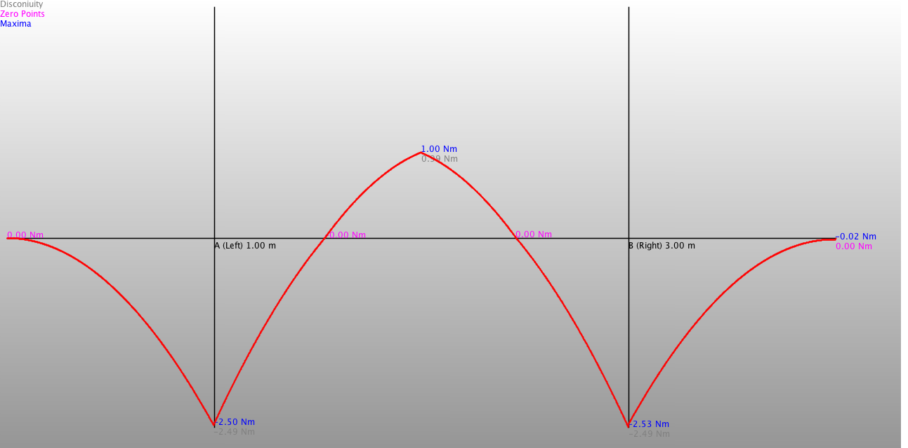

Beam Calc
=========
Calculates the supporting forces of a simply supported beam.

Beam and acting loads
---------------------

Sample output
-------------

Graphical solution:

Screenshot of "Beam Calc". An Android app using this library. The screenshot shows the problem. The solution is shown in the following shell- output:

You can get the Android app here:
[Google Play, Beam Calc](https://play.google.com/store/apps/details?id=berthold.beamcalc)

